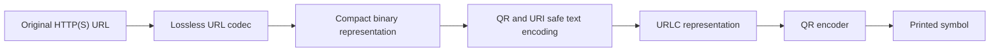
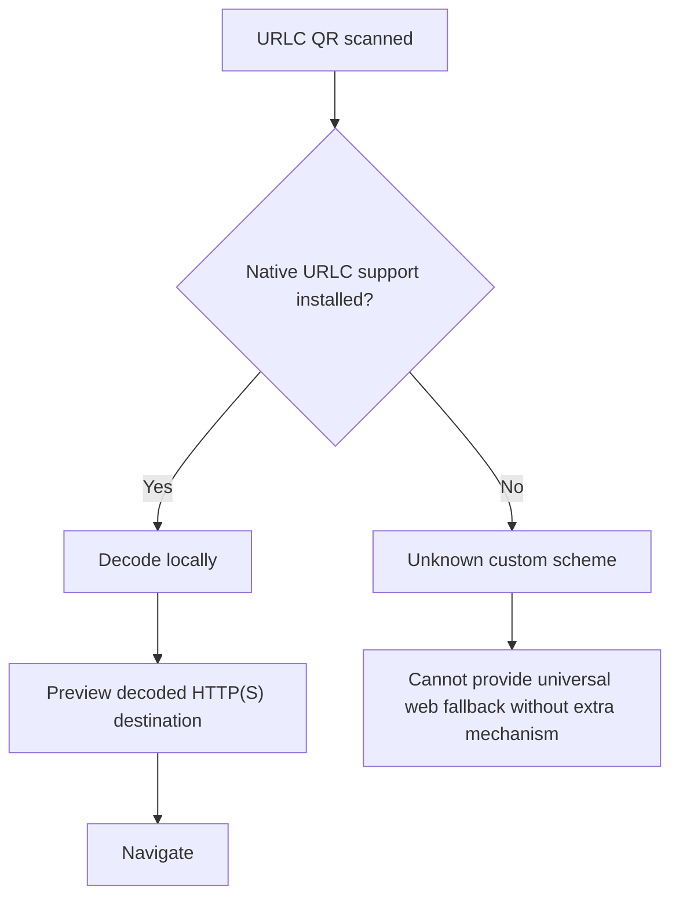

# Original URLC concept research report

> [!CAUTION]
> **Historical and superseded.** This was the initial technical feasibility report. Its recommendation to proceed to a proof of concept predates the kill-oriented validation framework. Gate 1 later concluded **Insufficient evidence**, so no PoC was built and the project was suspended. See the [publication-facing report](../research-report.md) and [decision record](../validation/stage-0-gate-1-decision.md).

> [!NOTE]
> The original report was exported with internal research-tool citation markers that could not resolve outside that environment. Those markers were removed during archival preparation. A reconstructed primary-source register appears at the end; claims that cannot be confidently remapped are flagged for manual review in the repository preparation summary. The substantive historical recommendations have not been rewritten.

## Original title

**URLC Research Report: Feasibility of Lossless, Locally Decodable URL Compression for QR Codes**

## Executive summary

The attached research brief makes the intended subject sufficiently clear despite the original request describing the topic as unspecified. This report therefore treats **URLC, a proposed standardised, lossless, locally decodable representation of HTTP(S) URLs, optimised primarily for QR codes and requiring no third-party redirect service**, as the research topic. The brief asks whether URLC could reduce QR payload size while preserving offline decodability, avoiding link-shortener dependencies, and remaining sufficiently safe and interoperable for eventual browser or operating-system integration.

The central conclusion is that **URLC addresses a real problem, but the strongest justification is narrower than the original brief suggests**. Conventional shorteners such as Bitly resolve a short identifier through an HTTP redirect controlled by an intermediary. Bitly's own documentation describes this process as a 301 redirect from the short link to its destination and confirms that it collects metrics from link clicks. A locally decoded URL representation could eliminate this intermediary request and the associated service availability and observability dependency. It would not, however, make the ultimate web resource permanent. If the destination domain disappears or its content moves, URLC cannot restore it.

**There does not appear to be an existing IANA-registered `urlc` scheme as of the current registry snapshot, but significant prior art exists.** Most importantly, the IETF's Constrained Resource Identifiers work represents URI components in CBOR rather than characters and supports most HTTP URIs. As of 17 August 2026, it has reached the RFC Editor as **RFC-to-be 9988**, but remains blocked in final review rather than being a published RFC. This work overlaps substantially with URLC's proposed structural binary representation.

That overlap does **not** make URLC redundant. CRI is intended principally for constrained environments and deliberately normalises and constrains URI representations. URLC's proposed requirement for an exact round trip from an arbitrary HTTP(S) URL string creates a different problem. An exact lexical representation must preserve details such as percent-encoding spelling and other syntactic distinctions that a normalising representation may discard. RFC 3986 explicitly distinguishes normalisation and equivalence from identical URI spelling.

A second major finding is more fundamental: **standard Base45 cannot safely be inserted verbatim into the proposed `urlc:v1:<payload>` URI syntax.** Base45 was explicitly designed around QR Alphanumeric mode and includes all 45 QR Alphanumeric characters, including a literal space and `%`. RFC 3986 does not permit raw spaces as ordinary URI data and gives `%` special percent-encoding semantics. Consequently, either Base45 characters must be escaped, which damages compactness, or URLC needs another transport alphabet.

This changes the codec design space substantially. An unpadded Base32 representation is URI-friendly and entirely QR Alphanumeric, but carries approximately 10 per cent QR payload overhead over binary. Base64url is URI-friendly but its lowercase characters normally push the encoded data into QR Byte mode, giving approximately 33 per cent binary-to-QR payload overhead. Base45 is much more QR-efficient, with about 3.1 per cent asymptotic QR data-bit overhead, but its alphabet is not URI-safe without additional handling. A purpose-built alphabet using the **43 QR Alphanumeric symbols remaining after removing space and `%`** is therefore worthy of benchmarking. This is an inference from RFC 3986 and RFC 9285 rather than an existing standard.

The QR benefit itself is real and mechanically measurable. QR Code versions range from 21 by 21 modules at Version 1 to 177 by 177 at Version 40. Increasing payload size forces larger versions at a fixed error-correction level and encoding mode. At error-correction level M, an ordinary 184-byte URL requires Version 10 because Version 9 holds 180 Byte-mode characters while Version 10 holds 213. A 92-byte Byte-mode representation fits Version 6. If those 92 characters instead belong entirely to QR Alphanumeric mode, they fit Version 5.

That reduction has a substantial physical effect. Including the required four-module quiet zone on every side, Version 10 occupies 65 modules across, Version 6 occupies 49, and Version 5 occupies 45. At a fixed overall print width, moving from Version 10 to Version 6 increases each module's physical width by about **32.7 per cent**. Version 10 to Version 5 increases it by about **44.4 per cent**. Conversely, at a fixed module size, the occupied area falls by approximately **43.2 per cent** or **52.1 per cent**, respectively. DENSO specifies the four-module quiet zone and the QR version dimensions on which those calculations are based.

What is **not yet demonstrated** is that these geometric improvements translate into a universal, quantitatively predictable increase in scanning speed or reliability. Published scanning experiments show that physical size, distance, viewing geometry, device characteristics, print quality and error correction all matter. URLC should therefore claim "lower QR version and larger modules at equal print size" as an established benefit, while treating "faster or more reliable scanning" as a hypothesis requiring controlled experiments.

The recommendation is consequently **proceed, but do not standardise a URI scheme or commit to one compression algorithm yet**. The next stage should build a codec-neutral benchmark and test four separate propositions: exact URL round-trip correctness, binary compression performance, QR transport efficiency and optical performance. The URI scheme should be considered only after those gates show a material advantage over direct URLs and existing alternatives.

| Research question | Current finding | Confidence |
|---|---|---:|
| Is there a genuine architectural problem? | Yes. Redirect shorteners add another online resolver and observability point. | High |
| Does existing work already solve it? | Partly. CRI overlaps strongly with structural binary URI representation, but not necessarily URLC's exact lexical and QR/browser requirements. | High |
| Can fewer payload characters materially reduce QR size? | Yes, often substantially when a version boundary is crossed. | High |
| Is Base45 the obvious URLC transport encoding? | No. Raw Base45 conflicts with generic URI syntax because of space and `%`. | High |
| Will URLC improve scan reliability? | Likely in some regimes, but magnitude remains unproven. | Medium |
| Can `urlc:` work universally today? | No. A custom scheme requires a registered handler or native platform/browser support. | High |
| Does URLC make links permanent? | It can make decoding independent of a redirect service, but cannot preserve the destination resource itself. | High |
| Should a PoC be built? | Yes, provided the binary codec is separated from the URI wrapper and evaluated empirically first. | High |

## Scope, assumptions and methodology

The research covers the previous 5 to 10 years where recent evidence is material, while retaining older foundational standards such as RFC 3986 because URI syntax is defined by them. Standards, registries and platform behaviour were checked against their current state on **17 August 2026**. Sources were prioritised in the following order: IETF and RFC Editor specifications, IANA registries, official QR documentation, W3C material, browser and operating-system documentation, peer-reviewed research, current public datasets and finally vendor documentation where the vendor itself is the authoritative source for how its shortening product behaves.

The attached brief effectively divides into three candidate interpretations of the URLC problem. They are complementary rather than mutually exclusive, so this report investigates all three.

| Candidate research track | Principal question | Relevance | Evidence available |
|---|---|---:|---|
| Standards and prior art | Is URLC genuinely novel, and what existing URI work should it reuse? | Critical | Strong |
| Compression and QR performance | Can local reversible encoding reduce actual QR versions enough to matter? | Critical | Strong standards evidence, insufficient corpus benchmark |
| Security and deployment | Can users safely and practically open URLC codes without a resolver service? | Critical | Strong platform evidence, adoption outcome uncertain |

Several assumptions require explicit separation.

First, **lossless** is interpreted in its strongest useful form: decoding should reproduce the original URL octet sequence, not merely a URI that RFC 3986 considers equivalent. This matters because `https://EXAMPLE.com/%7Euser` and a normalised equivalent may identify the same resource under generic rules while not being identical strings. A codec claiming deterministic `URL -> encode -> decode -> original URL` should preserve lexical identity unless its specification explicitly relaxes that requirement.

Second, the target input is restricted to absolute `http:` and `https:` URLs. The codec is therefore not proposed as a general container for `file:`, `javascript:`, `data:` or arbitrary application protocols. This scope is narrower and much easier to secure than a general-purpose compressed URI mechanism.

Third, the primary optimisation objective is **QR symbol efficiency**, not text character count by itself. QR encodes Numeric, Alphanumeric and Byte modes differently, so a 100-character representation may outperform an 80-character representation if the former remains entirely in Alphanumeric mode while the latter forces Byte mode. QR optimisation must therefore be calculated in QR codewords and final QR version, not by `len(string)` alone. DENSO's capacity tables demonstrate the large differences between modes.

Fourth, "offline" means that **the compressed representation can be decoded into its original HTTP(S) URL without a network request**. It does not mean that the resulting web destination can be opened offline.

Fifth, this report does **not** present fabricated 1,000 to 10,000 URL compression results. A suitably stratified corpus has not yet been encoded by a concrete URLC implementation. Instead, the report establishes standards constraints, analytical QR break-even points, candidate algorithms and a reproducible methodology for obtaining those results. Population-level compression percentages should not be claimed until that benchmark exists.

A suitable corpus is readily achievable. Common Crawl maintains a public corpus exceeding 300 billion historical pages and adds billions of pages per month. Its current overview includes the 2026-30 crawl, and its URL Index is stored in Parquet for bulk analytical access with tools including Spark, Pandas, Polars, Arrow and DuckDB.

However, using random Common Crawl URLs alone would produce a biased benchmark. Crawlable public pages poorly represent authentication callbacks, enterprise resource URLs, expiring signed links and private SaaS applications. The attached 17-category taxonomy is therefore substantially better than a purely random web sample. A robust benchmark should use a held-out, stratified test corpus with domain-level deduplication and synthetic rather than live secret-bearing authentication tokens.

A defensible 10,000-record benchmark would use approximately 5,000 diverse URLs sampled from a public crawl, 4,000 deliberately balanced public URLs covering the proposed archetypes and 1,000 synthetic or adversarial cases. Training data used to construct a static token dictionary must be separate from the evaluation corpus. Otherwise the reported compression ratio would measure dictionary overfitting rather than generalisation.

For every URL, the benchmark should record UTF-8 byte length, URL components, encoded binary length, transport-text length, QR encoding segmentation, final QR version at L/M/Q/H, module dimensions, compression and decompression time, exact round-trip status and reasons for any expansion. The main result should be a **distribution**, including median, 5th and 95th percentiles, not merely a mean.

## Prior art and standards landscape

The closest prior art is not conventional URL shortening. It is the IETF's **Constrained Resource Identifier** work. CRI decomposes a URI into the familiar scheme, authority, path, query and fragment components and represents those components using CBOR. The specification says Simple CRIs support all CoAP URIs and most HTTP URIs, while deliberately constraining parts of generic URI syntax.

As of 17 August 2026 this work is considerably further advanced than the attached brief implies. The RFC Editor identifies it as **RFC-to-be 9988**, currently in final review and blocked pending actions. It therefore should be treated as imminent standards prior art, but not incorrectly cited as an already published RFC.

CRI creates both an opportunity and a challenge for URLC. The opportunity is that URLC does not need to reinvent every detail of URI component modelling, CBOR representation, normalisation rules and error handling. The challenge is that a proposal substantially duplicating CRI would have to demonstrate why a new representation creates enough additional utility to justify itself. RFC 7595 explicitly cautions that new URI schemes can impose deployment costs and should provide demonstrable, long-lived utility beyond existing mechanisms.

There is nevertheless a meaningful distinction. CRI is oriented towards compact identifiers inside constrained computing and protocol environments. URLC is considering **physical optical transport followed by user-facing HTTP navigation**. More importantly, CRI's normalised representation is not automatically suitable if URLC promises an exact byte-for-byte reconstruction of arbitrary input URL text. URLC should therefore evaluate a "CRI-derived semantic structure plus lexical-preservation escape" rather than either blindly adopting or ignoring CRI.

The attached brief also needs one factual correction regarding **CURIE**. The W3C document "CURIE Syntax 1.0" is a **W3C Working Group Note**, published on 16 December 2010, rather than a W3C Recommendation. CURIEs abbreviate IRIs using externally supplied prefix mappings. That makes them useful in RDF/XML-style contexts where both parties share a vocabulary, but not a self-contained reversible encoding for an arbitrary web URL.

**URI Templates, RFC 6570**, address a different problem. They provide a compact description of a family of URIs by expanding variables into a template. A template cannot recover an arbitrary URL without the template and variable context, so URI Templates are not a substitute for URLC's standalone reversible representation.

The landscape can therefore be summarised as follows.

| Technology | What it compacts | Self-contained decode | Generic arbitrary HTTP URL | Designed for QR | Requires online resolver | Relevance to URLC |
|---|---|---:|---:|---:|---:|---|
| HTTP shortener | Identifier via lookup table | No | Yes | Often used with QR | Yes | Baseline competitor |
| CRI / RFC-to-be 9988 | URI component representation | Yes | Most HTTP, with constraints | No | No | Very high |
| CURIE | IRI using shared prefix mapping | No, mapping required | No | No | Not inherently | Low to medium |
| RFC 6570 URI Templates | Families of URIs | No, variables/template required | No | No | Not inherently | Low |
| General binary compressor | Raw URL bytes | Yes | Yes | No | No | High |
| URLC | Proposed HTTP(S) representation | Intended yes | Intended yes | Yes | No | Research target |

The IANA URI Scheme Registry snapshot current in late July 2026 does not show an existing `urlc` registration in the retrieved registry material. This supports the proposition that the proposed scheme name itself is currently unallocated, but it does **not** establish novelty of the underlying compression idea. Standards novelty should be assessed against CRI and previous IETF discussions, not merely by checking for the exact string `urlc`.

A separate standards issue concerns the proposed syntax:

```text
urlc:v1:<payload>
```

RFC 7595 requires a new scheme to fit the generic URI syntax and says permanent schemes should document syntax, semantics, encoding, interoperability, security and long-term utility. Scheme names are case-insensitive when used in URIs, although their registration is lowercase.

That provides a useful optimisation possibility. The lowercase prefix `urlc:v1:` contains lowercase characters and therefore cannot itself be encoded in QR Alphanumeric mode. A canonical printed representation such as:

```text
URLC:1:<PAYLOAD>
```

could remain QR Alphanumeric, provided the payload alphabet also complies. `URLC` remains the same URI scheme under case-insensitive scheme comparison even though the IANA registration would be `urlc`. Whether real QR encoders optimally segment a lowercase prefix and an uppercase payload should still be benchmarked rather than assumed.

The bigger problem is Base45. RFC 9285 specifically recommends Base45 for storing binary data in QR Alphanumeric mode and defines an alphabet containing digits, uppercase letters, space, `$`, `%`, `*`, `+`, `-`, `.`, `/` and `:`. RFC 3986 makes `%` the introducer for percent-encoded octets and requires a literal percent data octet to appear as `%25`; raw space likewise does not belong to the ordinary URI character repertoire. **A raw RFC 9285 Base45 stream is consequently not a safe generic URI scheme-specific string.**

This is one of the most important findings of the research because it means the encoding layer cannot simply be specified as "compressed bytes plus Base45".

## Compression and QR economics

URLC has two independent optimisation stages:



The first stage must reduce information. The second stage necessarily adds some representation overhead to make arbitrary binary suitable for text and QR transport. Confusing these stages can result in apparently shorter strings that are actually less QR-efficient.

Base45 demonstrates the distinction particularly well. RFC 9285 maps two input bytes to three Base45 characters. QR Alphanumeric mode stores pairs of characters in 11 bits. Over sufficiently long input, every two binary bytes therefore produce roughly three characters costing 16.5 QR bits, compared with 16 original information bits. The asymptotic QR payload overhead is only about **3.1 per cent**, despite Base45 increasing textual character count by 50 per cent.

Ignoring small-message headers and framing, that means a binary URL compressor needs only slightly more than roughly **3 per cent actual byte reduction** before Base45's QR representation begins to beat direct ASCII Byte-mode encoding. Small URLC prefixes and QR segment headers raise the practical break-even point somewhat.

The problem is transport syntax, not Base45's QR efficiency. Three useful baselines should therefore be measured:

| Binary-to-text strategy | URI-safe without escaping | QR mode | Approximate QR data-bit overhead | Main issue |
|---|---:|---|---:|---|
| RFC 9285 Base45 | No | Alphanumeric | ~3.1% asymptotically | Space and `%` conflict with URI syntax |
| Unpadded RFC 4648-style Base32 | Yes for its A-Z and 2-7 data alphabet | Alphanumeric | ~10% | Less dense than Base45 |
| Base64url | Yes | Usually Byte | ~33.3% | Lowercase letters prevent QR Alphanumeric mode |
| Purpose-built 43-symbol encoding | Potentially | Alphanumeric | Theoretical floor close to Base45 | New codec and interoperability burden |

RFC 4648 defines Base32 and Base64 families, while QR Alphanumeric's character set and bit packing are defined by the QR standard and reflected in RFC 9285. The percentages above are analytical consequences of those encodings rather than benchmark measurements.

The custom 43-symbol option follows from taking the QR Alphanumeric alphabet and excluding the two problematic characters, space and `%`. With 43 symbols, the theoretical information content is about 5.426 bits per symbol, while QR Alphanumeric costs approximately 5.5 bits per character over long runs. A well-designed block conversion could therefore approach roughly 1 to 2 per cent transport overhead before framing. That efficiency is promising, but the benefit must be weighed against inventing another encoding standard.

For the **binary URL codec itself**, four approaches merit direct comparison.

A structural codec can exploit facts that ordinary compressors do not initially know: inputs are always HTTP(S), have known component boundaries and frequently contain predictable scheme prefixes, domain labels, query separators and common tokens. It can encode the URI as fields instead of repeatedly storing delimiters. CRI provides a mature example of this structural approach.

A static dictionary can replace strings such as `https`, common top-level domains, common query parameter names and recurring path tokens with compact indices. A fixed versioned dictionary is attractive for archival permanence because no external model is needed. Its weakness is corpus dependence: tokens learned from news websites may perform badly on signed cloud URLs or software repositories.

General compressors remain important baselines. Brotli, for example, combines LZ77-style back-references with entropy coding and a static dictionary. It should not be dismissed based solely on an assumed URL-length threshold. Whether its headers and models are worthwhile for 50, 100 or 500-byte URLs is an empirical question and must be benchmarked.

Finally, a hybrid codec could choose among modes on each URL: structural coding, general compression or literal passthrough. A one or two-bit mode discriminator can prevent incompressible signed or token-heavy URLs from suffering major expansion. This is particularly relevant to the attached categories containing JWT-like tokens, UUIDs, signatures and already encoded Base64 material, where the information content may be close to incompressible.

The QR version thresholds make even modest percentage savings valuable when they cross a boundary. DENSO specifies Version 1 through Version 40, with four modules added to each side for every version step. Error-correction levels recover approximately 7, 15, 25 and 30 per cent of symbol codewords at L, M, Q and H respectively, at a corresponding capacity cost.

The attached brief's 184 to 92-character example is particularly instructive. At ECC M:

| Representation | QR mode assumed | Capacity boundary | Required version |
|---|---|---|---:|
| 184-character ordinary URL | Byte | V9 = 180, V10 = 213 | V10 |
| 92-character URLC string | Byte | V5 = 84, V6 = 106 | V6 |
| 92-character URLC string | Alphanumeric | V4 is below the requirement, V5 is sufficient | V5 |

These capacities are from DENSO's QR version table. The result reveals that the original example is actually conservative if URLC can remain entirely QR Alphanumeric.

There is another interpretation. If compression produces **92 binary bytes before Base45**, RFC 9285 produces 138 Base45 characters. That payload fits within the Version 6 ECC-M Alphanumeric capacity of 154 characters. Thus a 184-byte Byte-mode URL going from Version 10 to Version 6 is numerically plausible under a Base45-style design, but the benchmark must state clearly whether "92" means compressed bytes or final text characters.

The physical consequences are substantial:

| QR result | Matrix | Including four-module quiet zone | Change relative to V10 |
|---|---:|---:|---|
| Version 10 | 57 x 57 | 65 modules across | Baseline |
| Version 6 | 41 x 41 | 49 modules across | ~32.7% larger modules at fixed total width |
| Version 5 | 37 x 37 | 45 modules across | ~44.4% larger modules at fixed total width |

At fixed module size, those same transitions reduce the required area, including the quiet-zone envelope, by roughly 43.2 per cent and 52.1 per cent. DENSO specifies both version dimensions and the four-module quiet zone.

This gives URLC a better success metric than "50 per cent fewer characters". The primary benchmark should be:

**percentage of test URLs for which URLC lowers QR version at the same ECC level and target encoder settings.**

A compression improvement that saves 20 per cent of bytes but remains inside the same QR version may have little physical benefit. Conversely, a 6 per cent saving that crosses a version threshold can immediately enlarge every module.

Optical claims must remain more cautious. Experimental QR literature shows that detection varies with module size, imaging distance, viewing angle, print process and device conditions. Larger modules should make sampling easier under otherwise identical geometry, but there is no defensible universal figure such as "URLC scans 40 per cent faster" without a dedicated experiment.

A proper optical test should therefore print identical destinations using direct URL and URLC representations at fixed physical dimensions, then vary illumination, angle, distance, motion blur and ECC level across multiple modern Android and iOS devices. Record first-frame detection probability and time-to-success rather than subjective "scannability".

## Security, privacy and deployment

URLC removes one security and privacy dependency but introduces another class of risk.

With a conventional shortening service, the scanner first connects to the shortening provider and receives a redirect. Bitly explicitly documents the 301 redirect architecture, can change link destinations on supported plans and performs abuse checks that can display an intermediary warning page. Bitly also says that click metrics are collected from HTTP headers and anonymised and aggregated for users without accounts.

Consequently, local URLC decoding provides a genuine privacy property: **there is no required request to a URLC resolver that learns every scan**. This does not provide anonymity. Once the decoded destination is opened, the destination server, DNS infrastructure and other normal web components can observe the request according to ordinary web behaviour.

It also removes one availability dependency. A Bitly-style printed link requires the short-link domain, DNS, HTTPS service and destination mapping to remain functional. Bitly states that its redirects are intended to be permanent, but architectural permanence still depends on that infrastructure being operated. Direct local URLC decoding does not.

This should not be overstated as archival permanence. Peer-reviewed research repeatedly finds substantial reference rot across ordinary web URLs. One 2023 review summarises large scholarly datasets in which significant portions of cited web resources became unavailable or changed, while earlier work found approximately 31 per cent of links inaccessible in one longitudinal information-science sample. URLC removes an **additional intermediary failure point**; it does not prevent the final origin URL from rotting.

The long-term claim should therefore be rewritten from:

> a QR printed in 2027 remains readable in 2047

to something closer to:

> a conforming URLC symbol can remain independently decodable into its originally encoded HTTP(S) URL without contacting a URLC-specific service, provided a conforming decoder remains available.

Whether that URL still resolves in 2047 is a separate preservation problem.

Destination obscurity remains a security concern. Both shortened URLs and compressed URLC payloads conceal the destination from visual inspection. Bitly itself provides a destination preview mechanism for this reason. A URLC decoder should therefore show the decoded **scheme, registrable domain, host and, where practical, path** before navigation.

The attached brief's restriction to HTTP(S) is sound. A decoder should reject any output that is not an absolute HTTP or HTTPS URL before handing it to a browser. It should apply this check to the parsed decoded result rather than merely inspecting a string prefix.

The proposed "SSRF" risk should be renamed. If decoding is genuinely local and performs no fetch, navigating to `http://127.0.0.1/` or a private network address is not server-side request forgery because no server is being induced to issue the request. It is better described as a **local-network navigation or confused-user risk**. A warning for loopback, link-local and private-address destinations may be sensible, but the same destination can already be encoded in a normal HTTP QR code.

General-purpose compression creates a separate resource-exhaustion risk. Decoders should impose a small maximum encoded payload, an explicit maximum decoded URL length and bounded processing. A URL format does not need to support megabytes of decompressed output to serve the stated QR use case.

The more serious deployment concern is custom-scheme handling.

On Apple platforms, an application can register a custom URL scheme, but Apple explicitly warns that custom schemes are an attack surface and that if multiple applications register the same scheme, which application receives it is undefined. Apple recommends verified universal links for website deep linking.

Windows also permits custom URI schemes and notes that more than one application may register to handle the same scheme, with user choice and platform behaviour governing the selected handler.

Android's stronger verified App Links mechanism specifically uses HTTP or HTTPS URLs plus a domain association file. This gives ordinary web links authenticated app ownership and a graceful web fallback, properties that a new unverified custom scheme does not inherently possess.

A browser-hosted decoder is not an immediate universal solution either. The standard `registerProtocolHandler()` mechanism permits custom web schemes beginning with `web+`, not arbitrary newly invented scheme strings, and browser support is not universal. The registered handler itself is an HTTPS URL, so using it as the primary URLC decoder would also reintroduce an online handler dependency unless the browser had native support.

This creates URLC's core deployment paradox:



A conventional `https:` QR works everywhere because scanners and browsers already know what to do with it. A `urlc:` QR can be smaller and independent of a redirect service, but only after the scanning environment has gained URLC support. An HTTPS fallback resolver restores compatibility but simultaneously gives back part of URLC's central architectural advantage.

For this reason, **scheme registration should not be the first deployment milestone**. RFC 7595 itself warns that creating a new URI scheme can require changes in clients and other infrastructure, and it asks proponents to demonstrate new, durable utility.

A more credible deployment progression is:

1. Codec library and QR benchmarking with no public scheme commitment.
2. Reference decoder application for controlled experiments.
3. Browser extension and mobile application prototypes, primarily to test UX.
4. Interoperability specification and independent implementations.
5. Only after empirical success, an IETF discussion on whether `urlc:` is the right standards vehicle.

The user-facing flow proposed in the original brief is directionally sound:

```text
QR scan
  |
Recognise compressed representation
  |
Local bounded decode
  |
Validate exact HTTP(S) URL
  |
Display destination host and security warnings
  |
User approval
  |
Normal browser navigation
```

One modification is important: phishing checks should not depend on a mandatory URLC network service, otherwise URLC has recreated the dependency it set out to eliminate. Browser-native reputation systems may continue to operate normally once the destination has been decoded, but the basic decode-and-preview path should remain local.

## Evidence strength, gaps and risks

The evidence currently supports **technical plausibility**, not yet deployment viability.

| Finding | Best evidence | Strength | Main limitation |
|---|---|---:|---|
| QR payload length affects version and physical density | QR standard information and DENSO capacity tables | Very high | Does not quantify user scan performance |
| Base45 is QR-efficient | RFC 9285 | Very high | Raw alphabet is not URI-safe |
| URI syntax conflicts with raw Base45 space and `%` | RFC 3986 + RFC 9285 | Very high | Alternative encoding still needs benchmarking |
| CRI substantially overlaps URLC | IETF draft and RFC Editor status | Very high | RFC 9988 is still unpublished as of 17 Aug 2026 |
| New custom URI schemes carry deployment cost | RFC 7595 + platform docs | High | Actual URLC vendor interest is unknown |
| Shorteners add an intermediary resolver | Bitly's own architecture documentation | High | One vendor does not describe every shortening service |
| Shortener intermediary can observe clicks | Bitly's own privacy/support documentation | High for Bitly | Practices vary by service |
| Web links suffer long-term decay | Peer-reviewed longitudinal studies | High | Rates vary greatly by corpus |
| Larger QR modules should improve robustness | QR geometry + empirical scanning literature | Medium-high | No URLC-specific experiment |
| URLC will usually produce worthwhile compression | Not yet measured | Low | Requires representative corpus |
| Browser vendors would implement URLC | No direct evidence | Very low | Ecosystem/adoption question |

The **largest empirical gap** is the URL corpus benchmark. Without it, no one can responsibly answer the project's most important economic question: what fraction of real QR-bound URLs cross at least one QR version boundary after URLC encoding?

The second gap is **lexical losslessness**. Before implementing a sophisticated compressor, the project needs a normative definition of equality. There are at least three possible promises:

| Losslessness level | Decoder guarantee | Difficulty |
|---|---|---:|
| Resource-oriented | Produces a URL intended to identify the same resource | Lowest, but ambiguous |
| URI-equivalent | Produces a URI equivalent under specified normalisation rules | Medium |
| Lexically exact | Reproduces precisely the original UTF-8/ASCII URL string | Highest, clearest |

For the archival and transparency rationale in the attached brief, the third is the strongest definition. It also makes testing trivial: decoded bytes must equal source bytes exactly.

The third gap is the **transport alphabet**. This should be resolved before broader codec optimisation because a compressor that saves 15 per cent but then loses 20 per cent to an unsuitable QR text encoding may provide no net benefit.

The fourth is **scanner behaviour**. QR generation libraries can use multiple QR modes within one symbol, but actual optimisation behaviour varies by implementation. A URLC benchmark must therefore test at least one standards-compliant optimiser and the practical libraries likely to be used by applications. Otherwise lowercase prefixes or alphabet choices can silently convert the entire string into Byte mode and erase the theoretical advantage.

The fifth is **adoption cost**. The proposal is valuable only if decoding support is likely to remain easier to preserve than an HTTP redirect service. A tiny open decoder specification is plausibly preservable for decades, but a QR scanned by an ordinary 2047 device is useful only if an implementation exists or can readily be installed.

There are also important stakeholder differences.

**Archival institutions, museums, government publishers and manufacturers of long-lived physical assets** have the strongest theoretical incentive because removing an externally operated redirect layer can reduce dependencies over long lifetimes. The same organisations may, however, prefer established persistent identifiers, controlled domains and web archives over a new client codec.

**Marketing organisations** have weaker incentives because shorteners deliberately provide redirectability and analytics. Bitly, for example, allows destinations attached to QR codes to be changed later. URLC's immutable destination is a disadvantage for campaigns that explicitly value post-print retargeting.

**Privacy-sensitive users** benefit from removing the compulsory third-party redirect request, although URLC is not itself an anonymity technology.

**Browser and OS vendors** bear most of the adoption and security cost. Their incentive depends on measured real-world QR benefit, which is why a standards proposal without empirical QR evidence would be premature.

The project should also recognise one trade-off that is easy to miss: **immutability and redirectability are opposing product properties**. URLC's inability to alter a printed destination later is exactly what removes the mapping-service dependency. This is a feature for archival records and a limitation for mutable campaigns.

## Recommendation and next steps

The recommendation is **continue URLC as an experimental research and codec project, but revise the architecture before implementation**.

The first architectural change should be to separate three layers completely:

```text
Layer A: exact HTTP(S) URL <-> compact binary URL representation

Layer B: compact binary <-> QR and URI safe textual representation

Layer C: textual representation <-> URI scheme / operating-system dispatch
```

This makes it possible to discover that Layer A is valuable even if `urlc:` eventually proves to be the wrong integration mechanism. It also allows Base32, a URI-safe 43-symbol alphabet and other transports to be compared without rewriting the compressor.

The second change should be to formalise **exact lexical round-trip correctness** as the PoC default:

```text
decode(encode(input_bytes)) == input_bytes
```

Normalised encodings may be offered as an experimental alternative, but they should not silently replace the original input.

The third change is to use CRI as mandatory prior art. The initial prototype should include at least one **CRI-derived structural representation** in the benchmark, or document precisely why CRI cannot meet the lexical and HTTP requirements. With RFC-to-be 9988 already in final review, ignoring that work would create an avoidable standards duplication risk.

The fourth is to **remove raw RFC 9285 Base45 from the proposed URI syntax until the escaping problem is solved**. It should remain a benchmark because it represents an excellent QR-efficiency baseline. Candidate transports should include unpadded Base32, Base64url, raw Base45 as a QR-only non-URI baseline, and a carefully specified URI-safe QR-Alphanumeric alphabet.

The fifth is to optimise against **QR version reduction**, not merely text length. The minimum benchmark output for each corpus category should contain:

| Metric | Why it matters |
|---|---|
| Original UTF-8 bytes | Establishes true source size |
| Compressed binary bytes | Measures codec effectiveness independently of transport |
| Final text characters | Helps debugging and transport comparison |
| QR mode segments | Detects accidental Byte-mode regressions |
| QR version at L/M/Q/H | Primary physical-performance metric |
| Version delta from direct URL | Main URLC success measure |
| Exact round-trip result | Mandatory correctness test |
| Encoder/decoder latency | Detects excessive complexity |
| Expansion ratio | Makes negative cases visible |

The corpus should be reported both globally and across the 17 URL archetypes from the attached brief. A dictionary trained on part of the corpus must be frozen before testing the held-out set.

A sensible feasibility threshold would not be "URLC always compresses". That is unrealistic for already compressed or random-looking URLs. A better research gate is whether the system achieves all of the following on the held-out test corpus:

**Correctness:** 100 per cent exact round trip for supported HTTP(S) inputs.

**Robustness:** malformed inputs fail deterministically, with strict memory and decoded-size bounds.

**QR usefulness:** a substantial fraction of long real-world URLs drop by at least one QR version at ECC M, with no severe regressions for ordinary shorter URLs.

**Complexity:** independent decoders remain small enough that the specification can reasonably be reimplemented years later.

**Transport:** the representation remains valid under RFC 3986 and does not depend on QR encoders performing unusual or undocumented mode tricks.

Only after those gates pass should the research ask the standards question: **does this functionality merit a `urlc:` URI scheme at all?**

RFC 7595 says new scheme deployment may require client and infrastructure changes and asks for demonstrable, long-lived new utility. URLC's standards case would therefore become substantially stronger if it could show, for example, that a fixed codec lowers QR versions on a large share of representative long URLs, can be implemented in a tiny offline decoder, has independent implementations and cannot achieve equivalent interoperability through an existing mechanism.

The revised research path is therefore:

| Phase | Deliverable | Decision gate |
|---|---|---|
| Codec semantics | Exact definition of supported URL input and lexical losslessness | Can every supported URL round-trip exactly? |
| Prior-art prototype | CRI-derived, structural-token and general-compression baselines | Does a bespoke codec outperform simpler standards-based approaches? |
| Transport benchmark | Base45, Base32, Base64url and URI-safe Alphanumeric candidate | Which representation minimises final QR version? |
| Corpus experiment | 1,000 minimum, preferably 10,000 held-out URLs | How often is QR version actually reduced? |
| Optical experiment | Printed controlled-condition test set | Are scan improvements measurable in practice? |
| Security prototype | Local decoder, preview, parser and abuse tests | Can processing remain bounded and unambiguous? |
| Ecosystem experiment | Windows, Android, iOS and browser integration prototypes | Is custom-scheme UX tolerable? |
| Standards decision | Draft architecture and interoperability specification | Is `urlc:` justified? |

The primary-source base for that work is already strong:

| Source | Purpose | Evidence quality |
|---|---|---:|
| RFC 3986, URI Generic Syntax | URI syntax, encoding, normalisation and equality considerations | Authoritative |
| RFC 7595, URI Scheme Guidelines | Requirements and costs of introducing a URI scheme | Authoritative |
| RFC 9285, Base45 | QR-oriented binary-to-text encoding | Authoritative |
| RFC 4648 family | Base32 and Base64 comparison | Authoritative |
| CRI / RFC-to-be 9988 | Closest structural binary URI prior art | Very high, final publication pending |
| RFC 6570 | URI Template prior art | Authoritative |
| W3C CURIE Syntax 1.0 | Prefix-based IRI abbreviation prior art | Authoritative W3C Note |
| IANA URI Scheme Registry | Existing registered schemes | Authoritative |
| DENSO QR standard and capacity material | Versions, capacity, ECC and physical QR geometry | High |
| Common Crawl URL Index | Large-scale URL corpus | High for public-web sampling |
| Apple custom scheme documentation | iOS/macOS handler and security behaviour | Authoritative |
| Microsoft URI launching documentation | Windows custom-handler behaviour | Authoritative |
| Android App Links documentation | Verified HTTP(S) deep-link model | Authoritative |
| Bitly documentation | Real shortener redirect and telemetry model | High for Bitly specifically |
| Peer-reviewed reference-rot literature | Evidence of long-term URL instability | High |

**Final assessment:** URLC is technically credible enough to justify a proof of concept, but the research changes what that proof of concept should be. The immediate innovation should **not** be "a new URI scheme using compression plus Base45". Raw Base45 is problematic inside generic URI syntax, CRI is much closer prior art than the initial matrix suggests, lexical versus semantic losslessness needs to be resolved, and universal custom-scheme handling is the largest deployment obstacle.

The strongest URLC architecture is instead a **small, immutable, exact, locally reversible HTTP(S) URL codec whose binary representation is independent of its QR text transport and whose URI wrapper is optional until justified by evidence**. If a held-out 10,000-URL benchmark then demonstrates frequent QR-version reductions, and controlled optical testing confirms a meaningful improvement in acquisition reliability, URLC would have a defensible case for further standardisation. Until those measurements exist, the project should remain an experimental codec and interoperability study rather than a proposed Internet-wide URI scheme.

## Reconstructed primary-source register

This register replaces non-portable citation markers from the original export. It does not upgrade the report's hypotheses into validation findings.

- [RFC 3986 — URI Generic Syntax](https://www.rfc-editor.org/rfc/rfc3986)
- [RFC 7595 — Guidelines and Registration Procedures for URI Schemes](https://www.rfc-editor.org/rfc/rfc7595)
- [RFC 9285 — The Base45 Data Encoding](https://www.rfc-editor.org/rfc/rfc9285)
- [RFC 4648 — Base-N Encodings](https://www.rfc-editor.org/rfc/rfc4648)
- [RFC 6570 — URI Template](https://www.rfc-editor.org/rfc/rfc6570)
- [IETF Constrained Resource Identifiers draft record](https://datatracker.ietf.org/doc/draft-ietf-core-href/)
- [RFC Editor queue](https://queue.rfc-editor.org/)
- [IANA URI Schemes registry](https://www.iana.org/assignments/uri-schemes/uri-schemes.xhtml)
- [W3C CURIE Syntax 1.0](https://www.w3.org/TR/curie/)
- [DENSO WAVE — QR Code information](https://www.qrcode.com/en/)
- [Common Crawl overview](https://commoncrawl.org/overview)
- [Common Crawl URL Index](https://commoncrawl.org/url-index)
- [Apple — Defining a custom URL scheme for your app](https://developer.apple.com/documentation/Xcode/defining-a-custom-url-scheme-for-your-app)
- [Android — Unsafe use of deep links](https://developer.android.com/privacy-and-security/risks/unsafe-use-of-deeplinks)
- [Android App Links](https://developer.android.com/training/app-links)
- [MDN — `registerProtocolHandler()`](https://developer.mozilla.org/docs/Web/API/Navigator/registerProtocolHandler)
- [Microsoft — Launch the default app for a URI](https://learn.microsoft.com/windows/apps/develop/launch/launch-default-app)
- [Bitly support documentation](https://support.bitly.com/)
- [GS1 Digital Link standard](https://ref.gs1.org/standards/digital-link/)
- [GS1 resolver standard](https://ref.gs1.org/standards/resolver/)
